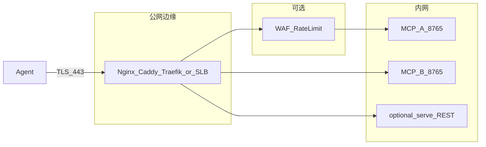

# 公网端口 + 内网转发（MCP / Codeindex）

在公网仅暴露 **TLS 入口**（如 `443`），将 **Streamable HTTP MCP** 与可选的 **`cli serve` REST** 反向代理到内网仅监听的 Uvicorn 实例。与 [mcp_delivery_handbook.md](./mcp_delivery_handbook.md) 一致：**一进程一 `HYBRID_DB`**；多库 = 多个内网 upstream + 边缘按路径/子域拆分。

## 架构

## 1. 边缘选型与 TLS 证书

| 方案 | 适用场景 | 证书 |
|------|----------|------|
| **Nginx** | 裸机 / VM、通用 | Let’s Encrypt（certbot）、商业 CA、内网 CA |
| **Caddy** | 单机自动 HTTPS | 内置 ACME |
| **云 SLB / ALB** | 云上 VM 或混合 | 控制台上传或托管证书 |
| **K8s Ingress / Gateway API** | 容器集群 | cert-manager、`tls` Secret |

内网到 MCP 通常使用 **明文 HTTP**，证书仅在公网边缘终止，减少内网证书运维。

**仓库内示例**（复制后改域名与 upstream）：

- [examples/nginx_mcp_streamable_http.conf](../examples/nginx_mcp_streamable_http.conf)
- [examples/Caddyfile.mcp_edge](../examples/Caddyfile.mcp_edge)
- [examples/kubernetes_ingress_mcp_streamable.yaml](../examples/kubernetes_ingress_mcp_streamable.yaml)

## 2. 内网 upstream 映射

| 变量 / 项 | 说明 |
|-----------|------|
| `HYBRID_MCP_HOST` | 生产建议 **`127.0.0.1`** 或仅内网网卡，避免 MCP 端口对公网直连。 |
| `HYBRID_MCP_PORT` | 默认 `8765`；多实例时每库不同端口。 |
| `HYBRID_MCP_PATH` | 默认 `/mcp`；**边缘对外路径必须与上游该路径一致**，或显式做 `rewrite` / `strip_prefix`。 |

**单库**：公网 `https://codeindex.example.com/mcp` → `http://127.0.0.1:8765/mcp`。

**多库（推荐路径前缀）**：

| 公网路径 | 内网 upstream |
|----------|----------------|
| `https://host/spring/mcp` | `http://10.0.1.10:8765/mcp`（Spring 专用进程，`HYBRID_DB=.../spring.db`） |
| `https://host/jdk/mcp` | `http://10.0.1.11:8765/mcp`（JDK 专用进程） |

每个 Agent **只连接属于自己的 URL**；不由 LLM 在 tool 参数里选库。参见手册 [§3 多索引库](./mcp_delivery_handbook.md#3-多索引库固定规则核心)。

**内网监听示例环境**： [examples/mcp_edge_internal_listen.env.example](../examples/mcp_edge_internal_listen.env.example)。

## 3. 代理调参（流式 / 长耗时）

MCP Streamable HTTP 可能使用 **SSE、chunked 或长轮询** 类响应，边缘需避免把响应体整块缓冲导致延迟或断连：

- **Nginx**：`proxy_buffering off`、`proxy_request_buffering off`、较大的 `proxy_read_timeout` / `proxy_send_timeout`（如 3600s，按业务调整）。示例见 `nginx_mcp_streamable_http.conf`。
- **Caddy**：对 SSE 常用 `flush_interval -1`（见 `Caddyfile.mcp_edge`）。
- **透传**：默认会转发 `Authorization`；勿在边缘剥离 **`Authorization: Bearer`**，否则应用层 [`HYBRID_MCP_BEARER_TOKEN`](../hybrid_platform/mcp_streamable_asgi.py) 校验失效。
- **WebSocket**：若将来协议升级，需 `proxy_http_version 1.1` 并转发 `Upgrade`、`Connection`（Nginx 示例中已预留注释）。

Uvicorn 若需信任 `X-Forwarded-*`（生成绝对 URL 等），见 [Uvicorn 文档 — Proxy headers](https://www.uvicorn.org/settings/)，按需配置 `proxy_headers` / `forwarded_allow_ips`，**非必改本仓库代码**。

## 4. 网络与安全组

- **防火墙 / 安全组**：MCP 监听端口（如 `8765`）仅允许 **边缘子网 / 反代内网 IP** 访问；公网安全组只开放 `443`（及 `80` 若做 ACME HTTP-01）。
- **限流**：在边缘对 `/mcp` 做连接数或请求速率限制；或仅允许 **VPN / 零信任** 后的源 IP 访问公网入口。
- **mTLS**（可选）：在边缘对客户端校验证书，内网仍 HTTP。
- **管理面隔离**：`cli serve` 的 `/admin/*` 使用 **`HYBRID_ADMIN_TOKEN`**，与 MCP Bearer 分离。若经公网转发，应 **独立路径 + 更严 ACL**，勿与 MCP 同策略。参见 [mcp_streamable_http.md](./mcp_streamable_http.md)。

## 5. 上线前验证

1. **Bearer**：启用 `HYBRID_MCP_BEARER_TOKEN` 时，无 `Authorization` 的 `POST` 应返回 **401** JSON（与 [test_mcp_streamable_asgi.py](../tests/test_mcp_streamable_asgi.py) 一致）。
2. **全链路**：从公网 URL 用真实 MCP 客户端完成 `initialize` 与至少一次 `tools/call`，确认无 **502**（超时/缓冲）、无意外 **401**（令牌或代理剥离头）。
3. **脚本（辅助）**： [scripts/verify_mcp_edge_proxy.sh](../scripts/verify_mcp_edge_proxy.sh) 可对任意 `https://host/mcp` 做快速探测（401 与带 Bearer 的非 502 检查）。

## 6. 与本仓库代码的关系

完成本部署 **通常无需改应用代码**：标准反向代理 + TLS + 安全组即可。

若需「单入口、服务端确定性多库路由」，见手册 [§3.4 若未来要做单进程多库](./mcp_delivery_handbook.md#34-若未来要做单进程多库扩展非当前实现) — 属于产品扩展，与本指南独立。
